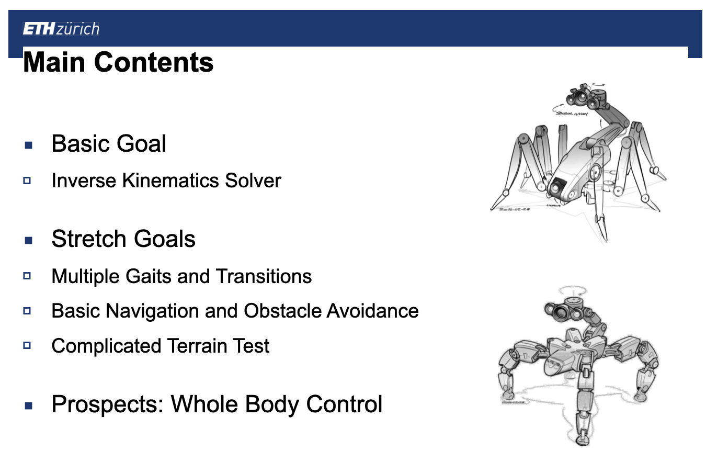
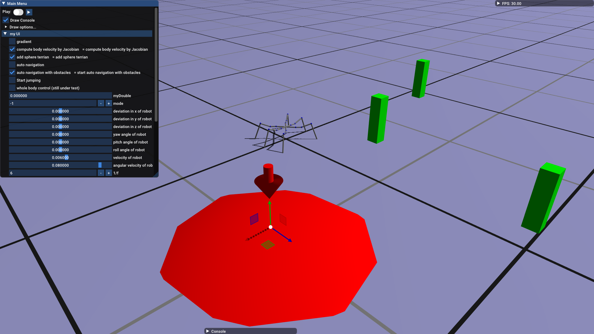

# **Simple Hexapod Robot Control**

Final project for the ETH course "[Computational Models of Motion](http://crl.ethz.ch/teaching/computational-motion-20/)".

## Code structure

We mainly modify/add code in the `src/app` folder.

- **main.cpp, app.h** 
  - manage the running of "Locomotion app" & UI interaction.
- **IKsolver.h** 
  - IKsolver class *(analytical)*, hexobjective class *(gradient-based)*: compute the desired joint angle given positions of end-effectors.
  - vel_objective class: compute the velocity of root position given velocities of end-effectors. 
  - whole_body_objective class: compute the generalized coordinates given the desired root accelerations.
- **GaitControl.h/cpp** 
  - compute the desired joint angle for multiple gaits, when `RBJointControlMode = POSITION_MODE`.
- **Whole_body_control.h** 
  - compute the desired joint torque, when `RBJointControlMode = FORCE_MODE`.

## UI

- **gradient:** 
  - switch between analytical method and gradient descent method for inverse kinematics.
- **compute body velocity by Jacobian:** 
  - switch between separate position control and uniform position control.
- **add sphere terrian:** 
  - add sphere-like terrain to the plane.

- **auto navigation:**
  - start auto navigation without obstacles & sphere terrain
- **auto navigation with obstacles:**
  - start auto navigation with obstacles

+ **Start jumping:**
  + start to jump
+ **whole body control (still under test):**
  + use whole body control

## Team Members

Please fill in the details of all team members. *Projects can be done individually or in teams (up to 3).*

| Legi Number | First Name | Last Name | github username                                         |
| ----------- | ---------- | --------- | ------------------------------------------------------- |
| 19-942-952  | Chao       | Ni        | [chaofiber](https://github.com/chaofiber)               |
| 19-950-229  | Kaiyue     | Shen      | [Skype-line](https://github.com/Skype-line)             |
| 19-952-134  | Ji         | Shi       | [StoneCanSave-ETH](https://github.com/StoneCanSave-ETH) |

## Final Delivery

- Our demo can be found here: [video](https://www.youtube.com/watch?v=EAShGZtsAMU&feature=youtu.be), [pptx](https://drive.google.com/file/d/1l1LPkwSD02C7TGUA06PApu1C4UaYlfRs/view?usp=sharing)

## References

[1] Chang, Qing, and Fanghua Mei. "A Bioinspired Gait Transition Model for a Hexapod Robot." *Journal of Robotics* 2018 (2018)

[2] Bjelonic, Marko, et al. "Keep rollin’—whole-body motion control and planning for wheeled quadrupedal robots." *IEEE Robotics and Automation Letters* 4.2 (2019): 2116-2123.

[3] https://scaron.info/teaching/friction-cones.html

[4] https://oscarliang.com/inverse-kinematics-implementation-hexapod-robots/

[5] Gurel, Canberk Suat. (2017). Hexapod Modelling, Path Planning, and Control. 

